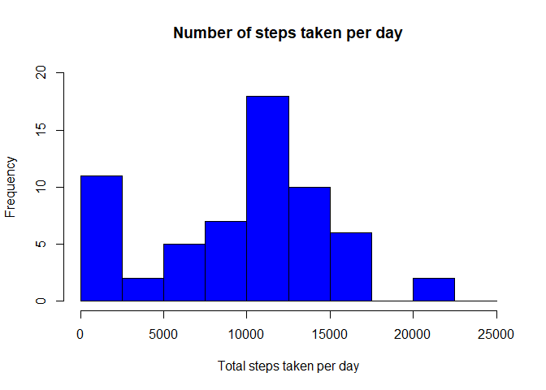
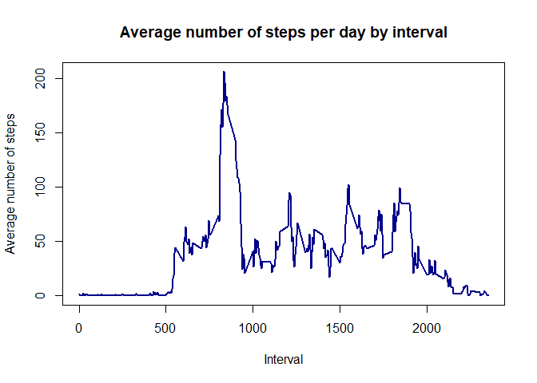
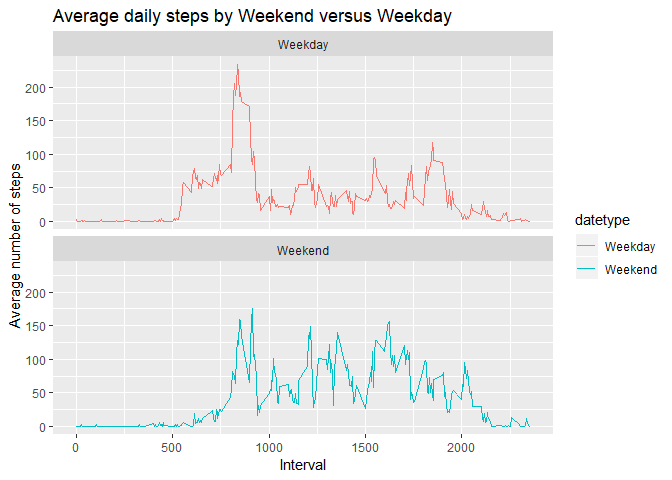

The following is the Code for reading in the dataset

```r
library(ggplot2)

activity <- read.csv("activity.csv")

activity$date <- as.POSIXct(activity$date, "%Y-%m-%d")
weekday <- weekdays(activity$date)
activity <- cbind(activity,weekday)
```
## Average Total Number of Steps taken per Day
Histogram of the total number of steps taken each day


```r
activity_total_steps <- with(activity, aggregate(steps, by = list(date), FUN = sum, na.rm = TRUE))
names(activity_total_steps) <- c("date", "steps")
hist(activity_total_steps$steps, main = "Number of steps taken per day", xlab = "Total steps taken per day", col = "blue", ylim = c(0,20), breaks = seq(0,25000, by=2500))
```

<!-- -->
Mean number of steps taken each day

```r
mean(activity_total_steps$steps)
```

```
## [1] 9354.23
```
Median number of steps taken each day

```r
median(activity_total_steps$steps)
```

```
## [1] 10395
```
Time series plot of the 5-minute interval (x-axis) and the average number of steps taken, averaged across all days (y-axis)

```r
average_daily_activity <- aggregate(activity$steps, by=list(activity$interval), FUN=mean, na.rm=TRUE)
names(average_daily_activity) <- c("interval", "mean")
plot(average_daily_activity$interval, average_daily_activity$mean, type = "l", col="darkblue", lwd = 2, xlab="Interval", ylab="Average number of steps", main="Average number of steps per day by interval")
```

<!-- -->
On average across all the days in the dataset, the 5-minute interval containing the maximum number of steps

```r
average_daily_activity[which.max(average_daily_activity$mean), ]$interval
```

```
## [1] 835
```

Total number of missing values in the dataset (i.e. the total number of rows with NAs)

```r
sum(is.na(activity$steps))
```

```
## [1] 2304
```

Strategy for filling in all of the missing values in the dataset. Will use average daily activity mean.

```r
imputed_steps <- average_daily_activity$mean[match(activity$interval, average_daily_activity$interval)]
```
New dataset that is equal to the original dataset but with the missing data filled in with mean
daily activity.

```r
activity_imputed <- transform(activity, steps = ifelse(is.na(activity$steps), yes = imputed_steps, no = activity$steps))
total_steps_imputed <- aggregate(steps ~ date, activity_imputed, sum)
names(total_steps_imputed) <- c("date", "daily_steps")
```
Histogram of the total number of steps taken each day using imputed data

```r
hist(total_steps_imputed$daily_steps, col = "darkblue", xlab = "Total steps per day", ylim = c(0,30), main = "Total number of steps taken each day", breaks = seq(0,25000,by=2500))
```

<!-- -->

Mean of the total number of steps taken per day using imputed data

```r
mean(total_steps_imputed$daily_steps)
```

```
## [1] 10766.19
```

Median of the total number of steps taken per day using imputed data

```r
median(total_steps_imputed$daily_steps)
```

```
## [1] 10766.19
```
##Differences in activity patterns between weekdays and weekends using imputed data
Create a new factor variable in the dataset with two levels - "weekday" and "weekend" indicating whether a given date is a weekday or weekend day.

```r
activity$date <- as.Date(strptime(activity$date, format="%Y-%m-%d"))
activity$datetype <- sapply(activity$date, function(x) {
        if (weekdays(x) == "Saturday" | weekdays(x) =="Sunday") 
                {y <- "Weekend"} 
        else 
                {y <- "Weekday"}
                y
        }) 
```
Panel plot containing a time series plot (i.e. type = "l") of the 5-minute interval (x-axis) and the average number of steps taken, averaged across all weekday days or weekend days (y-axis)

```r
activity_by_date <- aggregate(steps~interval + datetype, activity, mean, na.rm = TRUE)
plot<- ggplot(activity_by_date, aes(x = interval , y = steps, color = datetype)) +
       geom_line() +
       labs(title = "Average daily steps by Weekend versus Weekday", x = "Interval", y = "Average number of steps") +
       facet_wrap(~datetype, ncol = 1, nrow=2)
print(plot)
```

<!-- -->


